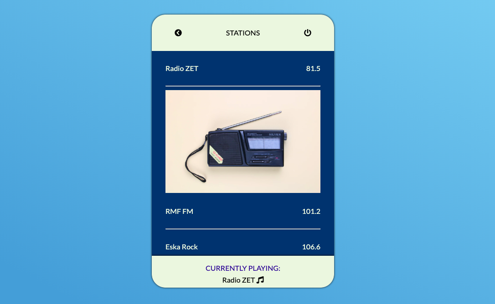

# Radio App
A simple radio widget.

[Website demo](https://agatapst.github.io/radio_app/index.html)

## Table of Contents
- General info
- Setup
- Technologies
- Additional info

### General info
This project is a simple radio widget. There is a list of radio stations - after selecting station, it toggles it and show the photo of an oldschool radio. After clicking the radio station, widget also displays its name at the bottom.

### Setup
Install dependencies

    $ npm install

Compile SASS & JS

    $ gulp watch

### Technologies
- CSS3 / SASS
- HTML5
- Vue.js
- Gulp 

### Status
The basic version of the project is done. 

### Additional info
The aim of the project was to learn the basics of Vue.js. 

Image was downloaded from [Unsplash](https://unsplashed.com).